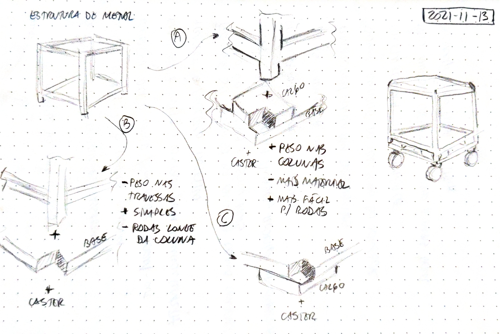

# Banquinho para peça

Início: 2021-11-13. Fim: ?

## Rascunho

## Requisitos

- Leve
- Desmontável
- Aguentar peso (70-90kg)
- Móvel (com rodinhas)

## Estrutura

A ideia é alterar um destes: <https://www.ikea.com/ca/en/p/bosnaes-footstool-with-storage-ransta-black-20266701/>. Custo: 30 CAD / unidade.

Pra prender a madeira na armação vai ser difícil de furar, pois ela é de aço. Se possível, seria legal poder continuar usando a capinha quando quiser.

### Perguntas

- Dá para furar a armação para parafusar a madeira da base?
- Como prender a base na armação?
  - A) Usar uma base e calços?
  - B) Usar uma base com encaixes cortados?
- Seria melhor colocar um novo tampo?

---

[Ver outros projetos](../README.md)
